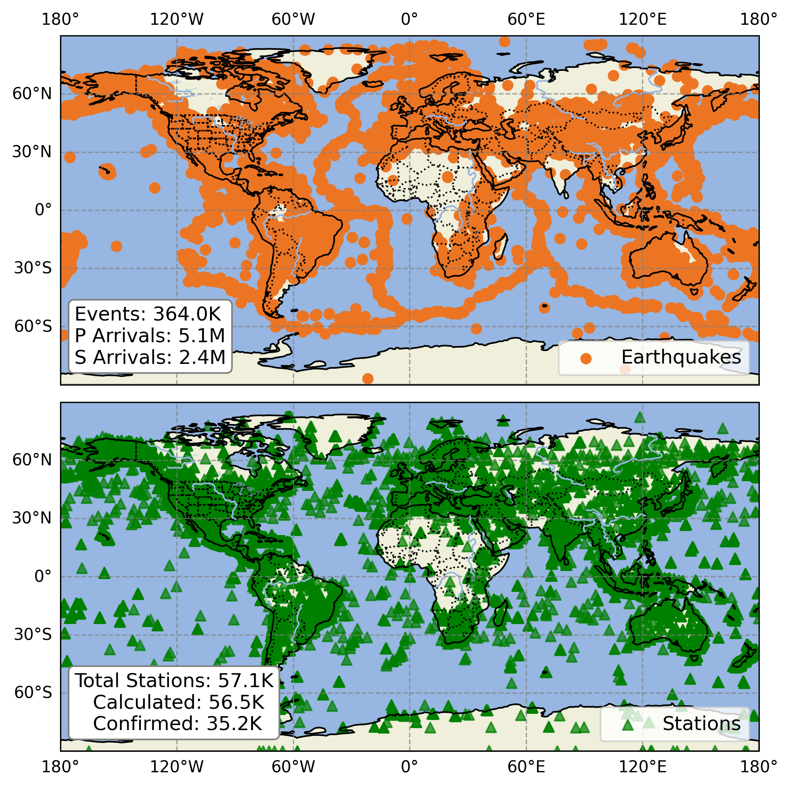
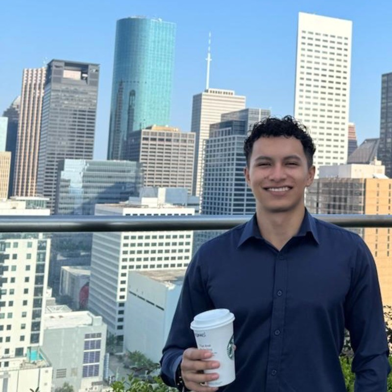
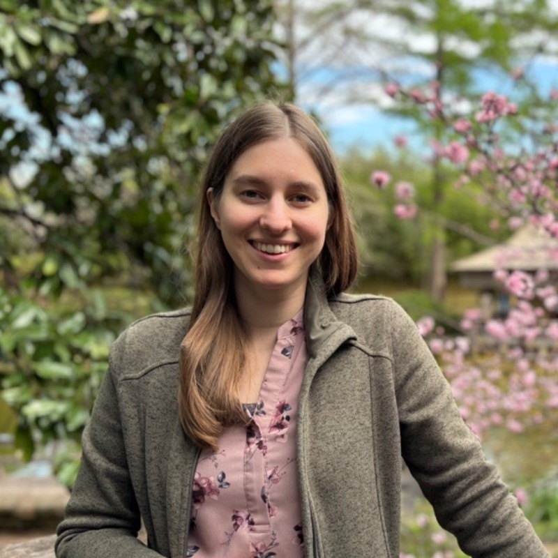
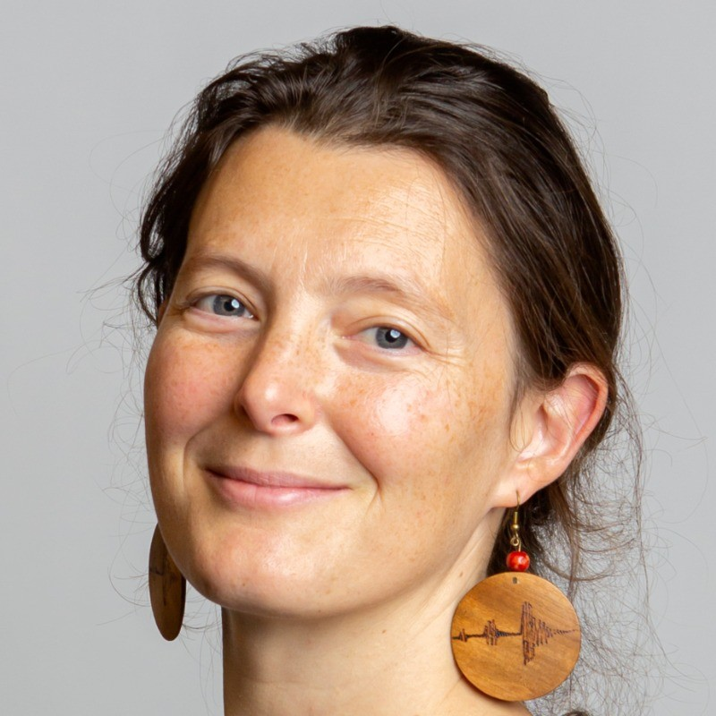

[](https://pypi.org/project/utdquake/)    [](https://www.linkedin.com/in/ecastillot/) 


 

<!--
# <span style="background:#E87500; color:white; padding:2px 6px; border-radius:6px;">UTD</span>Quake
-->

 [](https://utdquake.readthedocs.io/en/latest/index.html)

**University of Texas at Dallas Earthquake Dataset**

A global earthquake dataset constructed from high-quality source and receiver metadata, including associated seismic phase picks across diverse station geometries.



# Documentation

Full documentation for UTDQuake is available here: 

 [](https://utdquake.readthedocs.io/en/latest/index.html)

You will see:

- QuickStart guide to get you up and running  
- Detailed API reference  
- Tutorials and example workflows  

# Dataset

The dataset is available on Hugging Face: **UTDQuake**  

[](https://huggingface.co/datasets/ecastillot/UTDQuake)


## Installation ([utdquake](https://pypi.org/project/utdquake))
```bash
pip install utdquake
```

## Why this dataset matters?

Curated datasets of earthquake **events and phase picks** are essential for modern seismology, especially in the AI era. While waveform datasets have advanced earthquake detection, multistation picks provide complementary information crucial for **phase association** and **earthquake location**.  

This dataset offers structured event catalogs, station metadata, and phase picks across networks, supporting reproducible research and the development of data-driven seismological methods.

## What’s inside?

| Directory   | Format        | Description |
|------------|---------------|-------------|
| `network/`   | `*.parquet`   | Network metadata. |
| `events/`   | `*.parquet`   | Earthquake event catalogs per network. |
| `stations/` | `*.parquet`   | Station metadata per network. |
| `picks/`    | `*.parquet`   | Seismic phase pick datasets per network. |
| `bank/`     | `*.zip`       | ObsPlus `EventBank` datasets, one per network. Can be read directly using [ObsPlus EventBank](https://niosh-mining.github.io/obsplus/versions/latest/api/obsplus.bank.eventbank.html). |

For details on the contents and schema of each dataset, please refer to the [Hugging Face dataset viewer](https://huggingface.co/datasets/ecastillot/UTDQuake/viewer).

To get started, see the [Quick Start](#quick-start) section below, or click **“Use this dataset”** on the Hugging Face dataset page for example loading code.


## Quick start

### Basic Access
```python
import utdquake as utdq

# dataset overview 
dataset = utdq.Dataset()
print(dataset)

# network level
network_data = dataset.networks
print(network_data)

dataset.plot_overview(savepath="utdquake.png")
```

### Network Data
```python
# load network 
network = dataset.get_network(name="tx")
print(network)

# events
events = network.events
print(events)

# stations
stations = network.stations
print(stations)

# picks
picks = network.picks
print(picks)
```

### Event Bank
Check [ObsPlus EventBank](https://niosh-mining.github.io/obsplus/versions/latest/api/obsplus.bank.eventbank.html) for more details.
```python
# get event bank
ebank = network.bank # 

# Example: Filter by event_id
ev_ids = events["event_id"].iloc[:5].tolist()
cat = ebank.get_events(event_id=ev_ids)
print(cat)

# Example 2: Other filter (check obsplus.EventBank for more details)
cat2 = ebank.get_events(minmagnitude=4.3)
print(cat2)
```


### Plot
```python
# get Obspy Event
network = dataset.get_network(name="tx")
network.plot_overview(savepath="overview.png")
network.plot_uncertainty_boxplots(savepath="uncertainty_boxplots.png")
network.plot_station_location_uncertainty(savepath="station_location_uncertainty.png")
network.plot_stats(savepath="stats.png")
network.plot_pick_histograms(savepath="histograms.png")
network.plot_pick_stats(savepath="pick_stats.png")
```

# Thanks

Thanks to the [UT Dallas HPC team](https://hpc.utdallas.edu/) for providing the computational resources for this dataset.  

We also thank the seismology and AI communities for their work in earthquake research, and Hugging Face for hosting and sharing open datasets.

We welcome feedback and contributions!

# Authors

<table>
  <tr>
    <td valign="middle">
      <strong>Emmanuel Castillo</strong><br>
      University of Texas at Dallas<br>
      <a href="https://www.linkedin.com/in/ecastillot/" target="_blank">
        
      </a>
      <a href="mailto:castillo.280997@gmail.com" target="_blank">
        
      </a>
    </td>
    <td width="100" align="center">
      
    </td>
  </tr>
  <tr>
    <td valign="middle">
      <strong>Nadine Ushakov</strong><br>
      University of Texas at Dallas<br>
      <a href="https://www.linkedin.com/in/nadineushakov/" target="_blank">
        
      </a>
      <a href="mailto:nadine.igonin@utdallas.edu" target="_blank">
        
      </a>
    </td>
    <td width="100" align="center">
      
    </td>
  </tr>
  <tr>
    <td valign="middle">
      <strong>Marine Denolle</strong><br>
      University of Washington<br>
      <a href="https://www.linkedin.com/in/marine-denolle-b528144b/" target="_blank">
        
      </a>
      <a href="mailto:mdenolle@uw.edu" target="_blank">
        
      </a>
    </td>
    <td width="100" align="center">
      
    </td>
  </tr>
</table>


